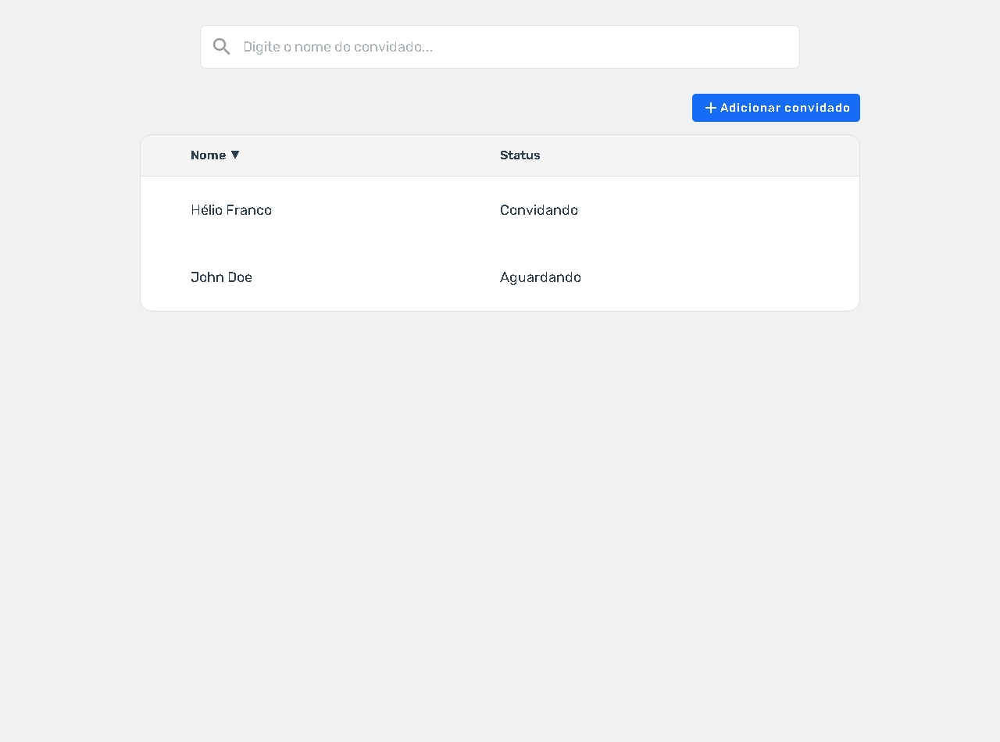
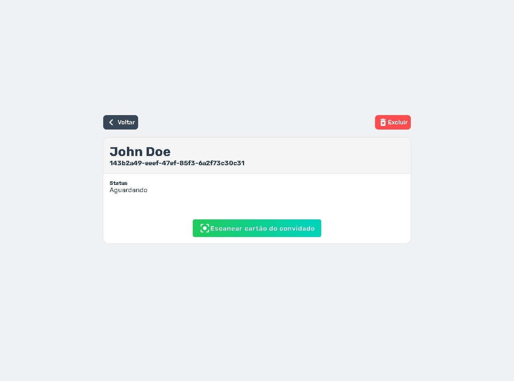

# Lista de convidados / Guest List

Aplicação front end de lista de convidados

-  Crie e remova os convidados
-  Gere um convite para um convidado
-  Scaneie a ID do usuário pela camera do dispositivo





## Recursos

-  Crie e remova os convidados
-  Gere um convite para um convidado
-  Scaneie a ID do usuário pela camera do dispositivo

## Ideias de recursos

-  Edição de convidados
-  Geração de QR Code ou código de barras para cartão do usuário
-  Proteção de rotas com autenticação
-  Perfil do evento (Para adicionar local, hora, etc)
-  Criação de múltiplos eventos

## Como continuar desenvolvimento

1. Clone o projeto
2. Instale as dependências do projeto

```bash
npm i
```

### Em desenvolvimento

3. Rode `npm run dev` ou `yarn dev` para iniciar o server em http://localhost:3000

## Em produção

3. Rode `npm run build` ou `yarn build`
